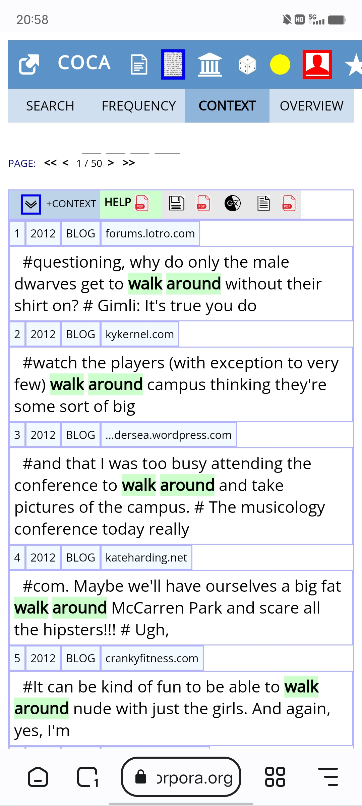

# english-corpora-google-extension

The [COCA](https://www.english-corpora.org/coca/) corpus is a large, balanced and up-to-date english corpus. Many people can use it for different purpose. As for language learner, it will be a wonderful learning tool. I found, however, its mobile style is not suitable for browsering, so I wrote this google extension for improving it. Then the search results will render as followed.

## How to use

After downloading this repo, installing `english-corpora-google-extension.crx` in your mobile browser. Please make sure your mobile browser is avalible for google extension. There is a list that can install google extensions:

+ [Kiwi](https://kiwibrowser.com/)
+ [Yandex](https://yandex.com/)
+ [狐猴](https://lemurbrowser.com/app/zh/)
